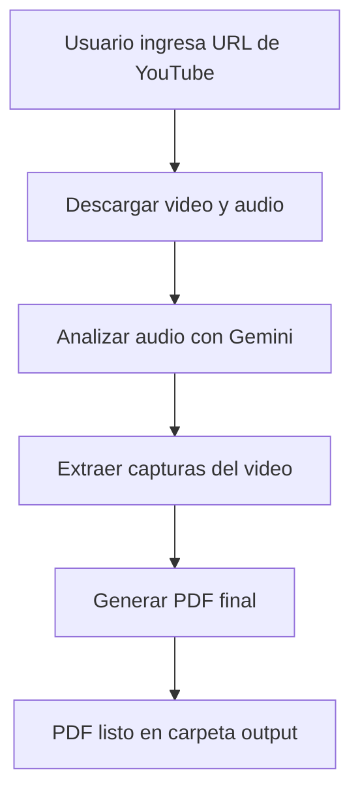

# Gemini Tube Guide

Convierte vídeos de YouTube en guías PDF con ayuda de IA (Gemini) y FFmpeg.

## Estructura del Proyecto

```text
.
├── .devcontainer/          # Configuración de entorno de desarrollo
├── .env                    # API KEY (no se sube al repo)
├── requirements.txt        # Dependencias Python
├── main.py                 # Script principal
├── src/                    # Módulos principales
└── output/                 # Resultados (PDF, vídeos, capturas)
```

## Diagrama de Flujo



## Instalación

1. Clona el repositorio:
   ```sh
   git clone https://github.com/tu-usuario/gemini-tube-guide.git
   cd gemini-tube-guide
   ```
2. Instala las dependencias:
   ```sh
   pip install -r requirements.txt
   ```
3. Añade tu API KEY en `.env`:
   ```env
   GEMINI_API_KEY=tu_api_key_aqui
   ```

## Uso

Ejecuta el script principal:
```sh
python main.py
```

Sigue las instrucciones en pantalla para generar tu guía PDF.

## Créditos
- Basado en Gemini API, FFmpeg y Python
- Autor: José Pablo Hernández

---
¡Contribuciones y sugerencias son bienvenidas!
