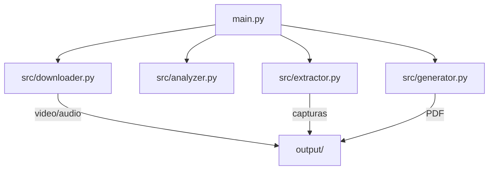

# Gemini Tube Guide

Convierte vídeos de YouTube en guías PDF con ayuda de IA (Gemini) y FFmpeg.

## ¿Qué hace?

- Descarga el video y extrae el audio de YouTube.
- Analiza el audio con Gemini para generar una guía paso a paso.
- Extrae capturas del video en los momentos clave detectados por la IA.
- Genera un PDF visual con texto, código y capturas.

## Estructura del Proyecto

```text
.
├── main.py                 # Script principal
├── requirements.txt        # Dependencias Python
├── .env                    # API KEY (no se sube al repo)
├── src/                    # Módulos principales
│   ├── downloader.py       # Descarga video/audio
│   ├── analyzer.py         # Analiza audio con Gemini
│   ├── extractor.py        # Extrae capturas del video
│   └── generator.py        # Genera el PDF
├── output/                 # Resultados (PDF, vídeos, capturas)
└── estructura.txt          # Ejemplo de estructura de guía
```

## Diagrama de Flujo


## Arquitectura de Módulos



## Instalación

1. Clona el repositorio:
   ```sh
   git clone https://github.com/tu-usuario/gemini-tube-guide.git
   cd gemini-tube-guide
   ```
2. Instala las dependencias:
   ```sh
   pip install -r requirements.txt
   ```
3. Añade tu API KEY en `.env`:
   ```env
   GEMINI_API_KEY=tu_api_key_aqui
   ```

## Uso

Ejecuta el script principal:
```sh
python main.py
```
Sigue las instrucciones en pantalla para generar tu guía PDF.

## Requisitos

- Python 3.8+
- FFmpeg instalado y en el PATH
- API Key válida de Gemini

## Solución de problemas

- **Error de cuota Gemini (429):** Espera el reset de cuota, usa otra API Key o revisa tu plan en [Gemini Usage](https://ai.dev/usage?tab=rate-limit).
- **Falta FFmpeg:** Instala FFmpeg y asegúrate que esté en el PATH.
- **Error de API Key:** Verifica que `.env` contiene `GEMINI_API_KEY`.

## Créditos

- Basado en Gemini API, FFmpeg y Python
- Autor: José Pablo Hernández

---

¡Contribuciones y sugerencias son bienvenidas!
